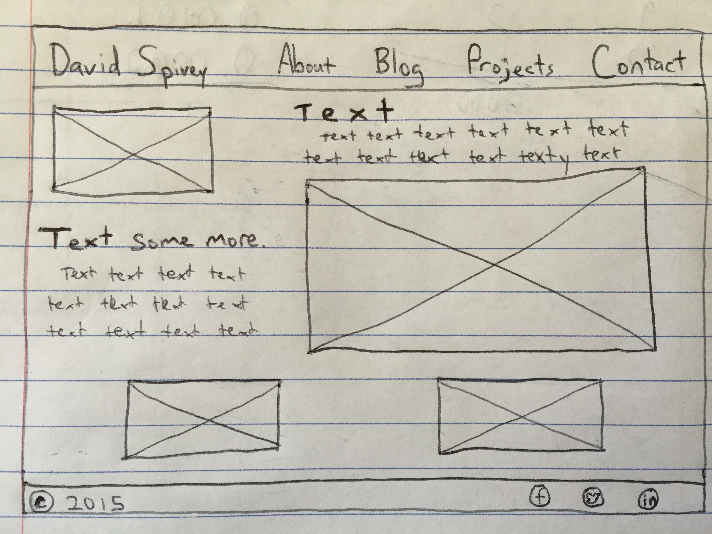
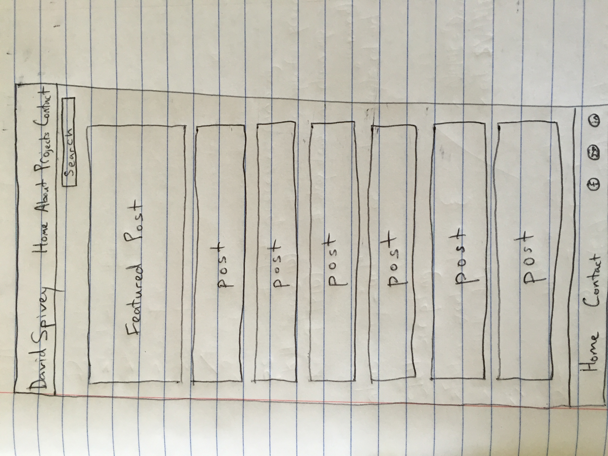

Wireframes are like a blueprint for how a site is to be layed out. This is one of the first steps in designing a site, after information gathering and doing a site map. It's meant to be a sketch representation without too much detail in order to determine the best organization of info and images and aesthetic flow.

Wireframing's main benefit is that it's a draft. A designer can hash out ideas without worrying about spending too much time or worrying about final details. It gives you an idea of the overarching design of a page.

I liked wireframing my index page because I had several different ideas and sketched little mini ones first. My blog page is still pretty boring because I've never had a blog and don't really know what to do with it, but when I get ideas for more content, at least I have something to reference. Though it is about as basic as possible at this point. Here are the images:

I didn't really revise the blog structure yet, but I will once I have a concept of the content. The index was my third sketch though, because I played with how to offset text and images, and how to keep it simple looking.

Mostly the questions I had in sketching these were about how other sites looked and how they used space. I referenced other sites offering a service or displaying projects for this.

I enjoyed conceptualizing the index page in a design sense for this challenge, but also found it tedious to draw on incomplete information to try to represent a future page. I'm not sure what kind of content I'll be displaying, and I think I spent too much time trying to imagine what sort of thing might fill up my page.