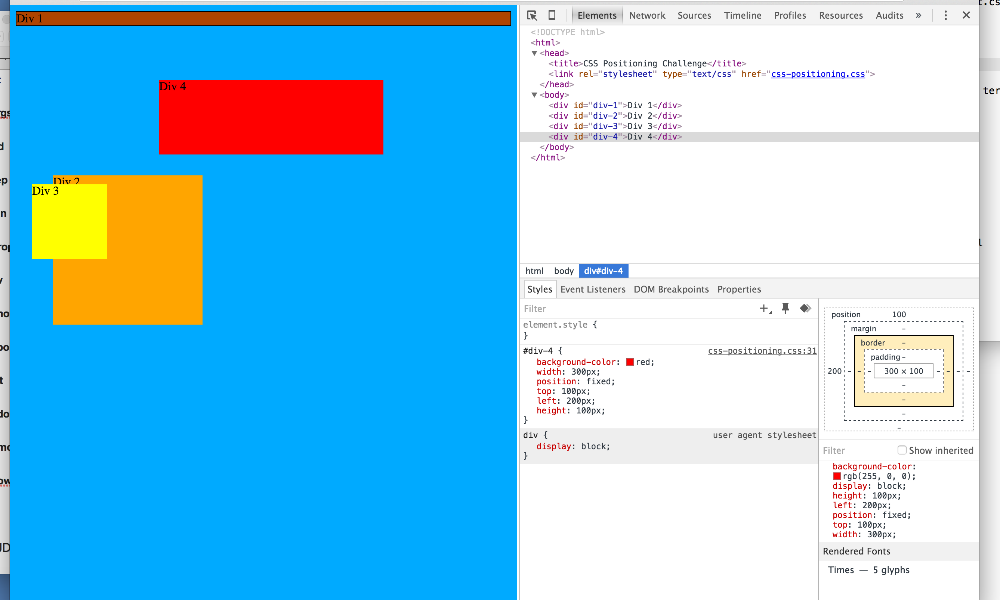
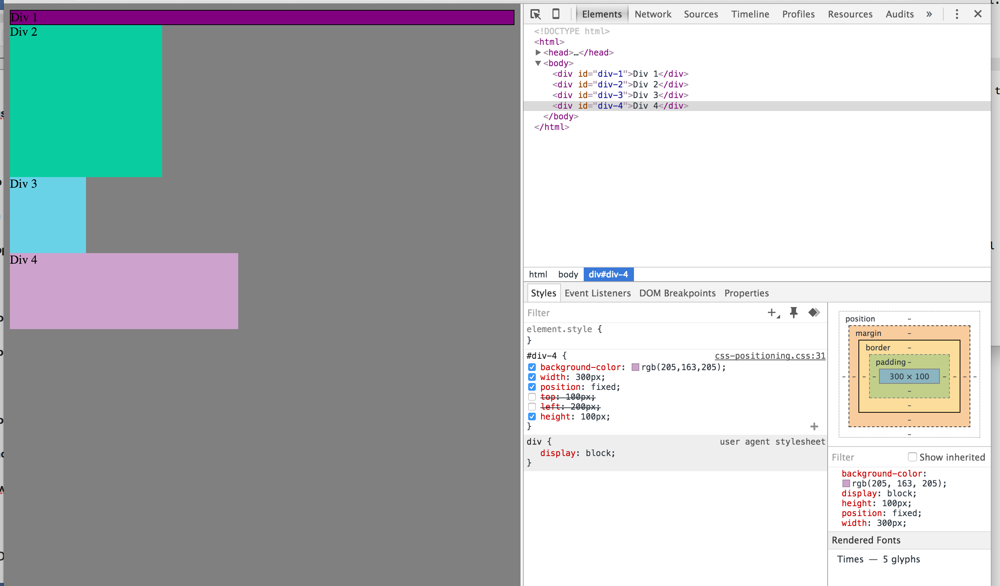
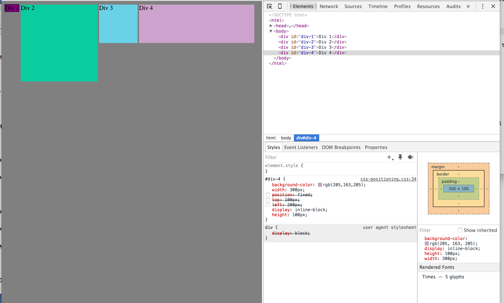
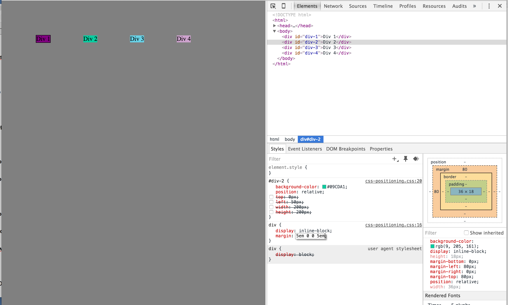
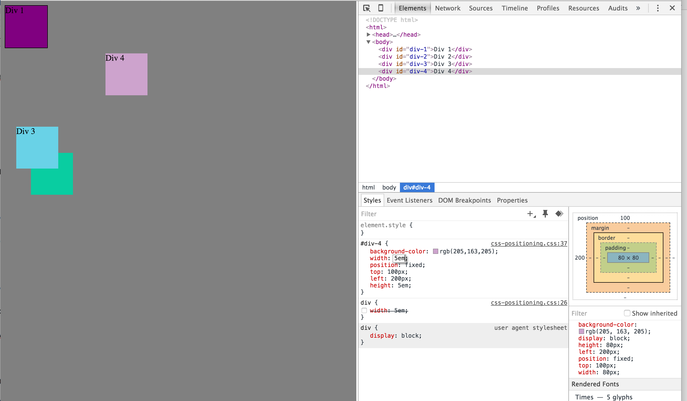
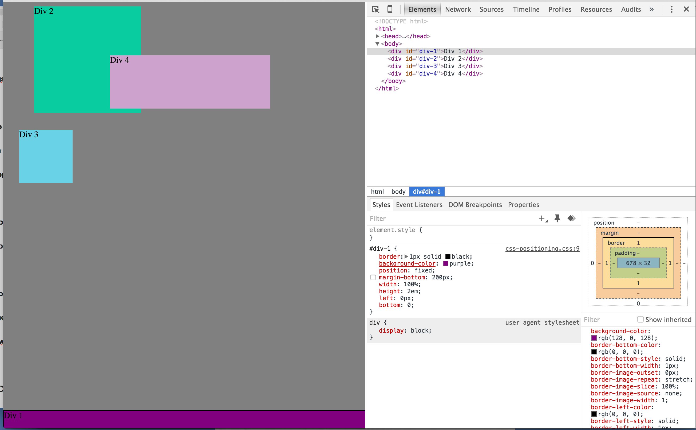
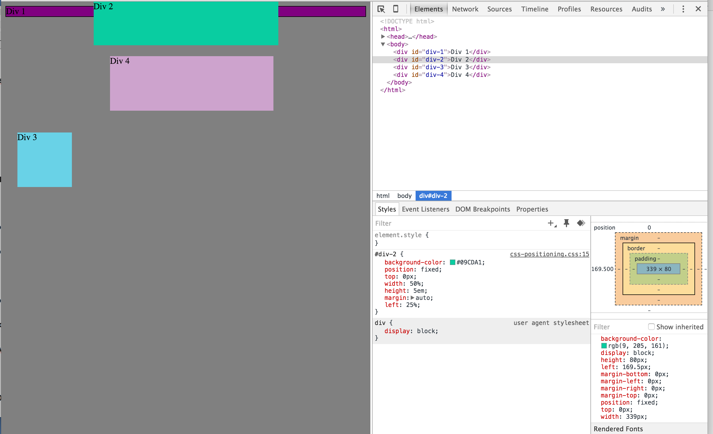
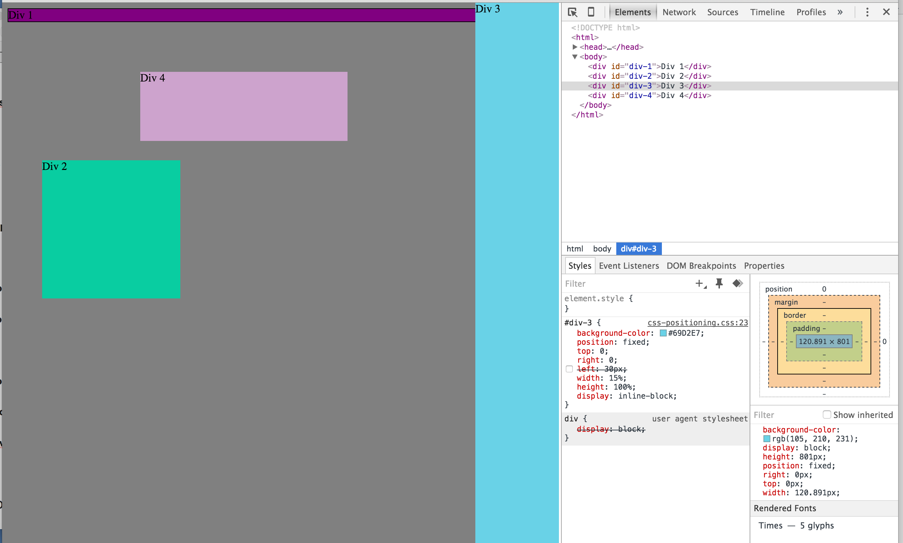
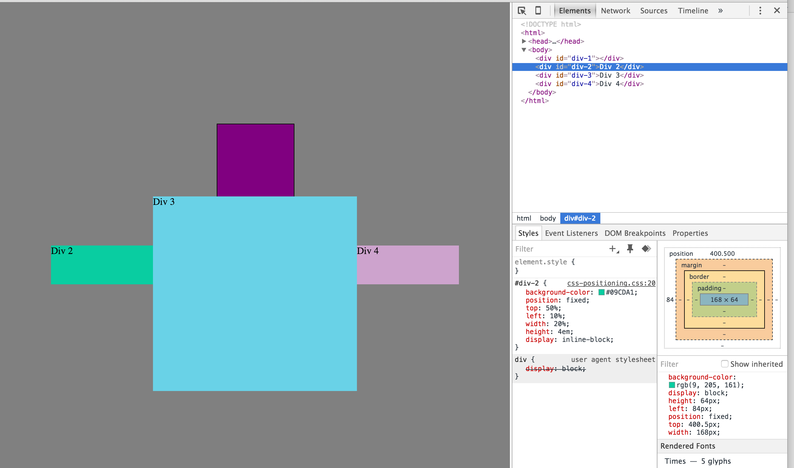

- How can you use Chrome's DevTools inspector to help you format or position elements?

DevTools is great because you can select certain elements from HTML and work on the aspects that affect them in CSS. All the changes are displayed in real-time in the browser window.

- How can you resize elements on the DOM using CSS?

If you select an element on the DOM in the HTML window, all the CSS is in the window below. You can change the aspects right from the inspector window, so size could be adjusted with
    height: 10em;
    or
    width: 50%;
    etc.

- What are the differences between absolute, fixed, static, and relative positioning? Which did you find easiest to use? Which was most difficult?

Static is the default value for an element. Elements will appear in the order they're rendered unless position is changed from static. Absolute positions the element in relation to a parent element, so if there's a
    

    within a
    <section>
the div is positioned relative to the section. Fixed position places the element in relation to <html>, so it remains in the same place on the browser window as you scroll. Finally, relative positioning places the element in relation to where the element normally would have been, for example, where it would have been placed had it been static, but modified by CSS like
    top: 25%;
which would move the element 25% down from where its original postion was.

- What are the differences between margin, border, and padding?

Each of these are boundaries of an element, but radiate out from the center in this order: padding, border, margin. Border is the physically evident boundary of the element, and is where a background color would be filled out to. Padding is a buffer between content and the border, so adding padding to the top of an element would push the text or content down from the top border. The margin is invisible, but dictates how mush space there is between the element and any other object.

- What was your impression of this challenge overall? (love, hate, and why?)

I liked the challenge because it was simple and game-like. My experience trying to dive a little deeper into CSS has been that elements don't all behave like these boxes, and trying to apply principles that work on simple colored boxes can be extremely frustrating and mysterious. So I'm glad this exercise was rudimentary because it's good to still feel like there's order in the universe.