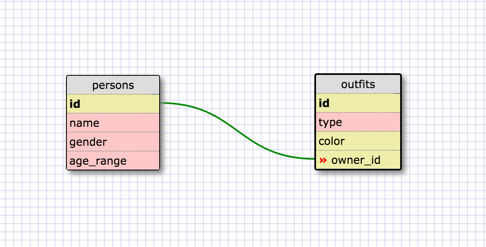

1. Select all data for all states.

SELECT * FROM states;

2. Select all data for all regions.

SELECT * FROM regions;

3. Select the state_name and population for all states.

SELECT state_name, population FROM states;

4. Select the state_name and population for all states ordered by population. The state with the highest population should be at the top.

SELECT state_name, population FROM states ORDER BY population DESC;

5. Select the state_name for the states in region 7.

SELECT state_name FROM states WHERE region_id = 7;

6. Select the state_name and population_density for states with a population density over 50 ordered from least to most dense.

SELECT state_name, population_density FROM states WHERE population_density > 50 ORDER BY population_density;

7. Select the state_name for states with a population between 1 million and 1.5 million people.

SELECT state_name FROM states WHERE population >= 1000000 AND population < 1500000;

8. Select the state_name and region_id for states ordered by region in ascending order.

SELECT state_name, region_id FROM states ORDER BY region_id;

9. Select the region_name for the regions with "Central" in the name.

SELECT region_name FROM regions WHERE region_name LIKE '%Central';

10. Select the region_name and the state_name for all states and regions in ascending order by region_id.

SELECT regions.region_name, states.state_name FROM states JOIN regions ON states.region_id=regions.id ORDER BY region_id;

Reflection:

What are databases for?

- Data! If it's a big set of data then a simpler data structure like an array or hash don't make sense.
- With relational databases information can be stored in a way that's more meaningful, with tiered relationships that can be utilized.

What is a one-to-many relationship?

- This is where to start when thinking about how your sets of data should be stored in an interconnected way.
- You can use your same DRY spider-sense to perceive that your tables are becoming too repetetive if values like a categorization are appearing too often.
- For example if you were listing classic ball players, it wouldn't make sense to have all major league players on one big list and put their team names in a column.
- "Babe Ruth belongs to The NY Yankees -- The NY Yankees has many players" exemplifies a "one-to-many" relationship, so we can set up a separate table of 'teams' which links to the 'players' table for better organization.

What is a primary key? What is a foreign key? How can you determine which is which?

- When linking tables, a foreign key of one table links to the primary key of another.
- In my example above the foreign key of the 'players' table would be a column of team identities that links to the primary key of 'teams'.
- That primary key of teams would be the list of team names, which are unique and so each value can act as a key for its corresponding dataset.
- This is how you determine which table contains a primary key. Each value in the key must be unique.

How can you select information out of a SQL database? What are some general guidelines for that?

- SELECT keyword gets you some data. You have to specify what to select and which table to retrieve it from at minimum. Then you can pile on constraints to get more specific.