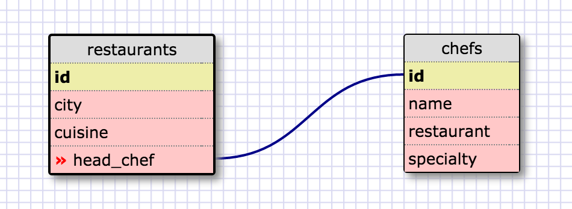
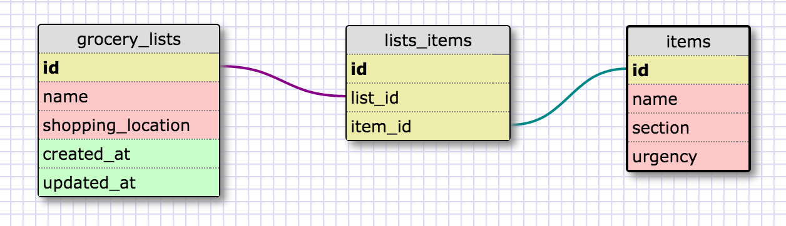

One-to-one:

In this schema each restaurant can have a head chef (foreign key) which is linked to the id (primary key) of the chefs table. The one-to-one relationship makes sense here because each restaurant should only have one head chef, and each chef will be cooking at that restaurant.
Optionally, a restaurant may have a NULL value for its head chef if it's like a Wendy's or something, in which case that id in 'restaurants' is not linked to any data in 'chefs'.

Many-to-many:

Reflection:

- What is a one-to-one database?

A relationship where the linked data are exclusive and unique. Each part of the linked data field relates directly to a set of data contained in the linked table.

- When would you use a one-to-one database? (Think generally, not in terms of the example you created).

Generally when an entity only has one of the type of attribute being catalogued, and that attribute is attached only to that entity.

- What is a many-to-many database?

The opposite of one-to-one. The attribute being linked from one table may have several matches from the other data set and vice versa.

- When would you use a many-to-many database? (Think generally, not in terms of the example you created).

In more complex data sets where each attribute is solely one value, but can be many of the values in the linked set.

- What is confusing about database schemas? What makes sense?

The most confusing part is when to choose which type of relational structure. Once you've conceptualized how you want to structure it though, it's easy to figure out which table has primary vs foreign keys.